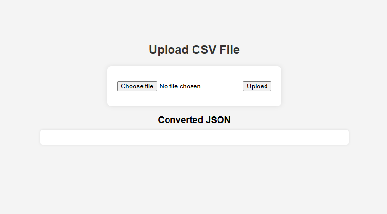
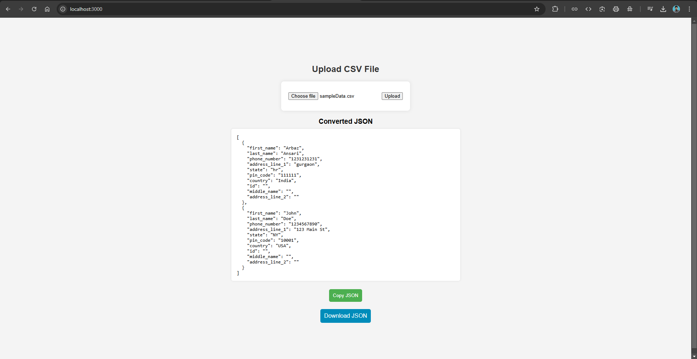

# CSV to JSON

A simple Node.js + Express + Multer application that allows users to upload a CSV file and automatically map its columns to a standard database structure, converting it to JSON.

## Images

    
    

## 🚀 Features

-   ✅ Upload CSV files via a web interface.
-   ✅ Auto-detects different CSV formats.
-   ✅ Maps CSV columns to standard fields.
-   ✅ Converts CSV data into structured JSON.
-   ✅ Displays JSON output on the frontend.

## 🛠️ Setup & Run Locally

1️⃣ Clone the repository

`git clone https://github.com/erarbazansari/csv-to-json.git`

2️⃣ Install dependencies
`cd csv-mapper`

3️⃣ Run the server
`npm install`

4️⃣ Open in browser:
`node server.js`

📌 http://localhost:3000/
